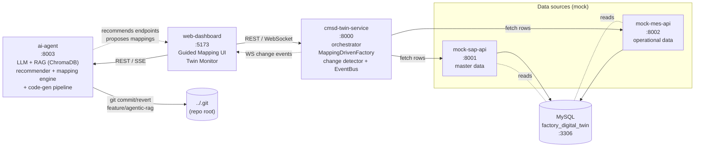

# TeaTwin-extended

**An LLM-assisted, human-in-the-loop system for mapping heterogeneous enterprise APIs (SAP, MES) to the CMSD (ISO 22400) digital-twin model — "Configuration, Not Code."**

TeaTwin-extended is a monorepo containing the **SAP/MES → CMSD digital twin** research platform, the **CMSD Pydantic schema library** it depends on, the **ISM 2026 paper** that publishes the approach, and the **ASMG data-requirements spec** that doubles as a RAG corpus. It is the artifact behind the paper *"Configuration, Not Code: A Human-in-the-Loop LLM Architecture for Mapping Heterogeneous Enterprise Systems to Canonical Digital Twin Models"* (Bohara et al., ISM 2026 / Procedia Computer Science).

> **The thesis in one sentence:** instead of writing per-customer integration code, an LLM proposes field-level API→CMSD mappings as JSON at *design time*; a deterministic engine assembles the twin at *runtime*; a human reviews only the fields the LLM flags as uncertain. The contribution is the **architecture**, not the model.

This README is the onboarding doc for new collaborators. For operational depth, it points to two companion docs inside the twin: [`sap-mes-cmsd-twin/SAP_ODATA_RUNBOOK.md`](sap-mes-cmsd-twin/SAP_ODATA_RUNBOOK.md) (running against real SAP) and [`sap-mes-cmsd-twin/PRD_MultiAPI_Mapping.md`](sap-mes-cmsd-twin/PRD_MultiAPI_Mapping.md) (the multi-API mapping product spec).

---

## Table of contents

1. [What is this?](#1-what-is-this)
2. [Repository structure](#2-repository-structure)
3. [Architecture at a glance](#3-architecture-at-a-glance)
4. [The two instantiation paths](#4-the-two-instantiation-paths)
5. [The end-to-end mapping pipeline](#5-the-end-to-end-mapping-pipeline)
6. [The SAP OData connector & security boundary](#6-the-sap-odata-connector--security-boundary)
7. [RAG + LLM subsystem](#7-rag--llm-subsystem)
8. [Data layer](#8-data-layer)
9. [Web dashboard](#9-web-dashboard)
10. [Running the project](#10-running-the-project)
11. [Testing](#11-testing)
12. [Conventions & gotchas](#12-conventions--gotchas)
13. [The ISM 2026 paper](#13-the-ism-2026-paper)
14. [Branches](#14-branches)
15. [Where to start as a new collaborator](#15-where-to-start-as-a-new-collaborator)

---

## 1. What is this?

A **digital twin** of a factory is a software model of its resources, products, processes, orders, and live operations, in a canonical simulation-ready format. The canonical format here is **CMSD** — the *Core Manufacturing Simulation Data* standard (ISO 22400), a structured XML/JSON schema covering ~30 entity types (resources, part types, BOMs, process plans, orders, jobs, calendars, layouts, connections, …).

The hard problem this project solves: **enterprise data needed to build a CMSD twin lives in many heterogeneous APIs** — SAP (master data: resources, BOMs, routings, calendars, orders) and MES (operational data: live status, jobs, inventory, incidents) — and every customer's APIs are shaped differently. Traditionally you write bespoke integration code per customer.

TeaTwin-extended replaces that with **configuration generated by an LLM and verified by a human**:

- **Design time** — a human picks a CMSD entity (e.g. `Resource`); the LLM, grounded by RAG over the source API's `$metadata` and the CMSD schema, recommends a *covering set* of API endpoints and proposes a field-by-field mapping (with transforms and cross-entity relations) as JSON. The human approves/edits only what the LLM flags uncertain.
- **Runtime** — a deterministic engine (`MappingDrivenFactory`) reads those JSON mappings, topologically sorts them by dependency, fetches the APIs, applies the transforms, coerces values to CMSD types, resolves cross-entity references, validates referential integrity, and emits a typed `CMSDDocument`.
- **Live** — a change detector diffs successive twin snapshots and streams changes to a dashboard over WebSocket.

A second, older path (the **code-gen pipeline**) lets LLM agents write Python into the twin service itself; it is kept as a fallback and is the approach the paper argues *against*.

---

## 2. Repository structure

This is a monorepo. The git root is `04_Playground` (remote: `TeaTwin-extended`). The application lives in `sap-mes-cmsd-twin/`; its Docker build context is the **repo root** (so it can `COPY` the sibling schema library and the RAG doc).

```
04_Playground/                      # git root (TeaTwin-extended)
├── README.md                       # this file
├── .gitignore                      # secrets, build artifacts, Docker volumes, Claude/local settings
├── .dockerignore                   # strips *.md from build context except Data_requirements_for_ASMG.md
├── cmsd-pydantic-master/           # CMSD (ISO 22400) Pydantic v2 schema library
├── Data_requirements_for_ASMG.md   # ASMG data-requirements spec → indexed as RAG "data-requirements" corpus
├── PROCS_ISM_LATEX_Template/       # ISM 2026 paper (LaTeX) + figures + bibliography
└── sap-mes-cmsd-twin/              # the digital-twin application (4 Python services + React dashboard + MySQL)
```

### `cmsd-pydantic-master/` — CMSD schema library

Pydantic v2 models mirroring the CMSD v1.0 RelaxNG grammar (`src/cmsd-rng/`). The importable package is **`cmsd_schema`** (under `src/`), not `cmsd_pydantic`. Key modules:

| Module | Models |
|---|---|
| `cmsd_document.py` | `CMSDDocument` (root container) |
| `resource_entities.py` / `resource_configs.py` | `ResourceClass`, `Resource`, `ResourcesRequired`, typed configs (Buffer, Dispatcher, Robot, Warehouse, …), `EnergyModel` |
| `part_entities.py` | `PartType`, `Part`, `BillOfMaterials` |
| `process_planning.py` | `ProcessPlan`, `Process`, `ProcessGroup` |
| `production_operations.py` / `order_entities.py` | `Job`, `JobEffortDescription`, `Order`, `OrderLine` |
| `calendar_entities.py` | `Calendar`, `Shift`, `Holiday`, `Break`, `ShutdownPeriod` |
| `layout.py` / `connection_entities.py` | `Layout`, `Placement`, `Connection`, `PathSegment` |
| `entity_reference_definition.py` | all `*Reference` cross-entity pointer types |
| `xml_cmsd_conversion_util.py` | `cmsd_document_to_xml`, `save_cmsd_xml` |
| `basic_types.py` / `basic_structures.py` | enums (`TimeUnit`, `ResourceType`, `JobStatus`, …) + value types (`MeasuredValue`, `Duration`, `Currency`, `Distribution`, …) |

> **Install mechanism (important — see also §12):** `cmsd_schema` is **pip-installed inside Docker** (`sap-mes-cmsd-twin/Dockerfile.python` does `pip install ./cmsd-pydantic-master/`). It is **not** installed on the host. Production modules insert `cmsd-pydantic-master/src` onto `sys.path` at import time so local runs/tests resolve it. (A couple of those inserts point at a stale path but are harmless because the Docker pip-install / `PYTHONPATH` is what actually resolves the package.)

### `PROCS_ISM_LATEX_Template/` — the paper

Elsevier `elsarticle` (Procedia) sources for the ISM 2026 paper. Main file: `ISM2026_paper.tex`. Also: outline (`ISM2026_paper_outline.md`), content brief, architecture/DAG diagrams (`.drawio`/`.png`), `references.bib`, and the Elsevier template assets (`.cls`, `.sty`, `.bst`). See §13.

### `Data_requirements_for_ASMG.md` — ASMG spec / RAG corpus

A spec for the exhaustive data needed to generate a high-fidelity twin via Automated Simulation Model Generation (ASMG): Technical (layout, resources, incidents), Organizational (shifts, workforce, energy), System Load (orders, BOMs, routings), and Experiment data. In the twin it is copied into the Docker image and indexed as the `data-requirements` RAG corpus so the LLM grounds field proposals in domain requirements.

### `sap-mes-cmsd-twin/` — the application

```
sap-mes-cmsd-twin/
├── docker-compose.yml          # orchestrates all 6 containers (build context = repo root)
├── Dockerfile.python           # shared image for the 4 Python services
├── requirements.txt            # Python deps (notably: fastapi, sqlalchemy, chromadb, httpx, cryptography)
├── .env.example                # LLM/embedding provider config (SAP creds are runtime/compose env, not here)
├── PRD_MultiAPI_Mapping.md     # product spec: one CMSD entity stitched from multiple APIs
├── SAP_ODATA_RUNBOOK.md        # runbook: connect to real SAP S/4HANA OData + E2E smoke
├── ai_agent/                   # :8003 — LLM + RAG mapping engine, recommender, code-gen pipeline
├── cmsd_twin_service/          # :8000 — orchestrator, mapping factory, change detector, EventBus
├── mock_sap_api/               # :8001 — mock SAP master-data API (+ centralized ORM models)
├── mock_mes_api/               # :8002 — mock MES operational-data API (+ 5s simulation engine)
├── web_dashboard/              # :5173 — React+TS Guided Mapping UI + Twin Monitor
├── shared/                     # cross-service libs: transforms, coerce, crypto, odata/, config
├── database/                   # init.sql (32-table schema) + seed_data.sql (realistic factory)
├── scripts/                    # sap_metadata_probe.py — standalone real-SAP $metadata probe
└── tests/                      # test_e2e_real_sap.py — gated real-SAP E2E smoke
```

Each top-level application folder is documented in §3–§9.

---

## 3. Architecture at a glance

Six containers via `docker compose up`:

| Service | Container | Port | API prefix | Role |
|---|---|---|---|---|
| `mock-sap-api` | `mock-sap-api` | 8001 | `/api/sap/v1` | Mock SAP master data (unauth): resources, parts, BOMs, process plans, calendars, orders, layouts, connections |
| `mock-mes-api` | `mock-mes-api` | 8002 | `/api/mes/v1` | Mock MES operational data: resource status, jobs, inventory, incidents (+ 5s sim engine) |
| `ai-agent` | `ai-agent` | 8003 | `/api/agent/v1` | LLM + RAG engine: endpoint recommendation, field mapping, chat, code-gen pipeline |
| `cmsd-twin-service` | `cmsd-twin-service` | 8000 | `/api/cmsd/v1` (+ `/ws/events`) | Orchestrator: builds the `CMSDDocument` from mappings, diffs, publishes changes |
| `web-dashboard` | `cmsd-dashboard` | 5173 | — | React+TS UI: Guided Mapping wizard + Twin Monitor |
| `mysql` | `factory-mysql` | 3306 | — | `factory_digital_twin` DB (32 tables, seeded realistic factory) |



**Data flow for a mapping cycle (`POST /api/cmsd/v1/refresh`):**

1. The dashboard / user triggers a refresh.
2. `cmsd-twin-service`'s `CMSDOrchestrator.run_once()` runs **Phase 1** — `MappingDrivenFactory.build_all()`: topologically sort the confirmed mappings by their dependency DAG → for each, fetch the mapped API endpoints (retry/backoff) → follow each `instances.count_path` into the response → per row, resolve each `api_path`, apply the transform, coerce to the CMSD type, build the Pydantic entity → resolve `relations[]` into cross-entity `Reference` objects → validate referential integrity.
3. **Phase 2** — hardcoded `CMSDFactory` builds any entity types the mappings didn't cover (fallback).
4. **Phase 3** — `_merge_documents`: per entity type, **mapped takes priority**, hardcoded fills the gaps.
5. **Phase 4/5** — `ChangeDetector` diffs old vs. merged (identifier-keyed, not array-position); `EventBus` persists to `change_events` and fans out to WebSocket subscribers.
6. The dashboard's Twin Monitor updates live.

The **ai-agent** never participates in the runtime fetch — it only produces the JSON mappings (and optionally the code-gen commits) at design time.

---

## 4. The two instantiation paths

Both exist and both feed the same merged `CMSDDocument`.

### (a) Config-driven `MappingDrivenFactory` — *the paper's thesis*
`cmsd_twin_service/mapping_factory.py`. Pure runtime interpretation of JSON mappings — **no code generation**. Pipeline: load `*.json` from `.agent-mappings/` → topological sort (`mapping_registry.py`, stdlib `graphlib`) → fetch with retry → array extraction via `instances.count_path` → per-field `api_path` resolution → transform → CMSD type coercion → `relations[]` → `Reference` resolution → referential-integrity validation. Registries cover **18 CMSD entity types** and their reference types.

### (b) Code-gen pipeline — *the fallback the paper argues against*
`ai_agent/code_generation/` + `ai_agent/agents/`. A 3-agent loop:
- **Writer** (`agents/writer_agent.py`, temp 0.1) — generates the *complete* updated `cmsd_twin_service/api_client.py` + `cmsd_twin_service/factory.py`.
- **Reviewer** (`agents/reviewer_agent.py`, temp 0.0) — strict 10-point checklist; `APPROVE` / `APPROVE_WITH_MINOR_FIXES` / `REJECT` (up to 3 Writer retries).
- **Tester** (`agents/tester_agent.py`, **non-LLM**) — `ast.parse` syntax check + antipattern scan (hardcoded secrets, bare `except`, `print()`), 10s timeout.
- **GitManager** (`code_generation/git_manager.py`) — atomic commit of the generated files onto **`feature/agentic-rag`** (never `main`), with `.agent-backup` rollback safety; JSON reports to `.agent-reports/`.
- **HealthMonitor** (`ai_agent/health_monitor.py`) — after commit, polls the twin service; **3 consecutive 5xx → auto `revert_last_commit`**.

### How they coexist
`run_once()` always runs Phase 1 (mapping-driven) **and** Phase 2 (hardcoded `CMSDFactory`), then merges with mapped-wins. The code-gen pipeline mutates the Phase-2 source files (`factory.py`/`api_client.py`) and commits to `feature/agentic-rag`; with `uvicorn --reload` + writable source bind-mounts, committed changes hot-reload into the running twin, and the health monitor auto-reverts if they break it.

---

## 5. The end-to-end mapping pipeline

The dashboard's **Setup Wizard** (`web_dashboard/src/components/SetupWizard.tsx`) drives a 5-step flow. The companion PRD ([`PRD_MultiAPI_Mapping.md`](sap-mes-cmsd-twin/PRD_MultiAPI_Mapping.md)) is the full spec.

1. **Connect LLM** (`AgentConnect.tsx`) — configure chat + (optional) separate embed provider (Ollama / OpenAI / Anthropic / OpenAI-compatible). `POST /api/agent/v1/agent/connect`.
2. **Connect Sources** (`ConnectSources.tsx`) — add SAP/MES data sources by base URL + auth; test connectivity. For SAP OData sources, **Discover** (`EntitySetBrowser.tsx`) browses the `$metadata` entity sets; row preview is **local to the browser only** — never sent to the LLM.
3. **Guided Builder** (`MappingWizard.tsx`):
   - Pick the CMSD entity (`RichEntityPicker.tsx` — dependency-aware: shows what's already mapped / blocked).
   - **Recommend endpoints** (`EndpointRecommendation.tsx` → `POST /mapping/recommend-endpoints`): the LLM, over RAG, proposes a *covering set* of OData endpoints for that entity, with per-field attribution, join keys, coverage gaps, and proposed `relations[]`. **Approve** pre-fills the endpoint rows.
   - **Fetch** (`EndpointRow` + `PayloadViewer`) — fire the endpoints, view raw JSON.
   - **Map** (`POST /mapping/analyze-stream` — SSE) — the LLM proposes a field mapping rendered by `MappingTable.tsx`, with per-field `TransformSelector.tsx` (`unit_conversion` / `enum_map` / `to_decimal` / `string_template` / `divide_by` / `multiply_by` / `default_value`). Edit/approve/flag fields; `MappingChat.tsx` lets you ask the LLM questions and apply updates; `smartReanalyze` refines from free-text guidance.
4. **Manual Builder** (`ManualBuilder.tsx`) — hand-author mappings for any entity not covered by APIs.
5. **Review Queue** (`ReviewQueue.tsx`) — list confirmed mappings, run a **pre-flight** (`POST /refresh/validate`: dependency closure, relation targets, field coverage, API reachability), then **Generate** (`GenerateModal.tsx`): `preflight → fetching APIs → building entities → merging with twin → detecting changes → applying to twin`. Confirmed mappings are persisted to `.agent-mappings/*.json` (`PUT /mapping/{id}/confirm`).

### The 9 deterministic transforms (`shared/transform.py`)
`none`, `unit_conversion`, `enum_map`, `to_decimal`, `to_integer`, `string_template`, `divide_by`, `multiply_by`, `default_value`. `unit_conversion` is **factor-only** (`value * factor`) — the factor is computed at runtime by `shared/odata/units.py` from the SAP unit code; the LLM never sees unit values or factors.

---

## 6. The SAP OData connector & security boundary

The connector that lets the twin map **real SAP S/4HANA OData** services lives in **`shared/odata/`** (consumed by `ai_agent/odata_ingest.py` and `ai_agent/api_explorer.py`). It is the subject of [`SAP_ODATA_RUNBOOK.md`](sap-mes-cmsd-twin/SAP_ODATA_RUNBOOK.md).

| File | Role |
|---|---|
| `shared/odata/client.py` | **`ODataClient` — the only code that connects to SAP.** GET-only (writes need CSRF, out of scope). `fetch_metadata` / `fetch_service_document` / `fetch_entity_set`. Adds `sap-client`, `$format=json`, `DataServiceVersion: 2.0`, auth headers. |
| `shared/odata/parser.py` | `EdmxParser` — EDMX/CSDL `$metadata` → `SourceSchema` (**metadata only**, namespace-tolerant). Extracts entity types, keys, `sap:label`/`sap:unit`/`sap:semantics`, navigation properties, referential constraints. |
| `shared/odata/source_schema.py` | `SourceSchema` dataclasses + `to_chunks()` → one metadata-only RAG chunk per entity type (collection `source-schema`, stable IDs). |
| `shared/odata/auth.py` | `build_auth_headers` + `normalize_auth` (normalized auth dict ↔ HTTP headers), shared by the OData client and the runtime fetch path. |
| `shared/odata/units.py` | SAP unit-code → CMSD `TimeUnit` + conversion factor. **Runtime-only**, never imported by the LLM. Unknown code → `None` → runtime leaves the value raw + emits a `field_warning` (never guesses). |
| `ai_agent/odata_ingest.py` | `ODataIngestor.discover()` — fetch `$metadata` → parse → persist schema → index `source-schema` chunks into ChromaDB. `sample()` fetches a few rows for **local UI preview only**. |

### The security invariant (read this)
> **The LLM never connects to SAP, never receives credentials, and never sees row data — only metadata via the `source-schema` RAG corpus.** Row data stays local to `MappingDrivenFactory` and the browser-only `/sources/{id}/sample` preview. SAP credentials are **Fernet-encrypted at rest** with `SAP_CRED_KEY` (shared by ai-agent and cmsd-twin). When `SAP_CRED_KEY` is unset → dev/no-key mode (plaintext auth block).

This boundary is what makes it safe to point an LLM at a real production SAP system: the LLM reasons over *shape* (entity sets, fields, labels, units, navigation), not *data*.

---

## 7. RAG + LLM subsystem

Lives in `ai_agent/` (`:8003`, API prefix `/api/agent/v1`).

**Vector store** — a single ChromaDB `PersistentClient`, one collection **`cmsd-rag-corpus`** (`hnsw:space=cosine`), embedding dim 2560 (`qwen3-embedding:4b`). Corpora are distinguished by a free-form `collection` metadata tag (filtered in Python, not via Chroma `where`, to avoid metadata-indexing quirks):

| `collection` | Content |
|---|---|
| `data-requirements` | `Data_requirements_for_ASMG.md` (domain requirements) |
| `cmsd-schema` | `cmsd-pydantic-master/src/cmsd_schema` (the mapping *target*) |
| `codebase` | `cmsd_twin_service/`, `ai_agent/`, `shared/config.py` (mock APIs intentionally excluded) |
| `api-docs` | user-uploaded docs to `ai_agent/api_docs/` (currently empty) |
| `source-schema` | SAP OData `$metadata` chunks, populated dynamically by `discover`, tagged with `source_id`/`entity_set`/`entity_type` |

**Providers** (`ai_agent/llm/`) — `ProviderManager` keeps **separate** chat and embed providers (embed falls back to chat if none configured separately). Registry: `ollama`, `openai`, `anthropic`; `deepseek`/`together`/`grok`/`openrouter`/`perplexity`/`github-models`/`custom` all alias to the OpenAI-compatible provider. `GET /api/agent/v1/agent/providers` lists presets. Defaults lean Ollama (`qwen3.5:397b-cloud` chat); paper evaluations used DeepSeek.

**Key modules**
- `recommender.py` — `EndpointRecommender`: Phase 1 deterministic per-field retrieval from `source-schema`; Phase 2 LLM-over-RAG assembles the covering endpoint set with attribution + join keys + coverage gaps + proposed `relations[]`.
- `mapping_engine.py` — `MappingEngine`: `propose_mapping` / `propose_mapping_multi` / `chat_about_mapping` / `review_reanalyze` / `smart_reanalyze` / type validation. Largest module.
- `connection_manager.py` — source CRUD; Fernet-encrypted persistence to `.agent-mappings/credentials/sources.json` when `SAP_CRED_KEY` is set.
- `api_explorer.py` — live payload fetch (routes SAP OData v2 URLs through `ODataClient` so responses are JSON, not Atom/XML) + field-path/type/sample extraction.
- `cmsd_catalog.py` — introspects the CMSD Pydantic models into a human-readable entity catalog for the UI.
- `code_generation/` + `agents/` — the code-gen pipeline (§4b).
- `rag/` — `vector_store.py`, `retriever.py` (multi-corpus context assembly), `document_loader.py`.

**Endpoints** — full surface in `ai_agent/routes.py`: `/agent/*` (connect/status/test/models/providers), `/sources/*` (CRUD + `/discover` + `/schema` + `/sample`), `/rag/*`, `/mapping/*` (recommend-endpoints, analyze, analyze-stream, chat, edit, validate-types, fetch, confirm, queue), `/mappings/*`, `/cmsd-catalog`, `/code-generation/*`, `/git/*`.

**Local without ChromaDB/Ollama** — `ai_agent/tests/conftest.py` mocks `chromadb`/`ollama` and the rag/llm/code-gen submodules, so route tests run with no vector DB or LLM. `AUTO_INDEX_ON_STARTUP=0` disables startup indexing in Docker (no LLM bundled); the service still serves APIs.

---

## 8. Data layer

### MySQL — `factory_digital_twin` (32 tables)
Schema in `database/init.sql`, realistic seed in `database/seed_data.sql`. Loaded on first init of the `mysql_data` named volume (MySQL runs `/docker-entrypoint-initdb.d/` alphabetically: `01-init.sql` then `02-seed.sql`). Creds: `factory_user` / `factory_pass` (root: `rootpass`).

- **SAP master data** (21 tables): `resource_classes`, `resources`, `part_types`, `parts`, `bills_of_materials`, `bom_components` (recursive), `process_plans`, `processes` (nested), `process_resources`, `calendars`, `shifts`, `breaks`, `holidays`, `shutdown_periods`, `resource_shift_assignments`, `orders`, `order_lines`, `layouts`, `placements`, `connections`, `cost_allocation`.
- **MES operational data** (7): `resource_status`, `jobs`, `job_constraints`, `job_effort`, `inventory`, `incidents`, `maintenance_plans`.
- **Change log** (2): `change_events` (written by `EventBus`), `poll_cycles`.
- **Skills** (2): `skill_definitions`, `employee_skills`.

The seed is a **mechanical-assembly factory**: 15 part types (raw / intermediate / finished), 13 resource classes (CNC mill/lathe, stamping, injection, pick&place, assembly, testing, conveyor, buffer, operator, transporter, source, sink) with realistic MTTR/MTBF/availability/cycle-time, BOMs, routings, calendars, orders, layouts, connections, jobs, inventory, skills.

> **Centralized ORM:** `mock_sap_api/models.py` is the single SQLAlchemy model file for **both** SAP and MES; `mock_mes_api` imports from it (MES has no `models.py`). All services read the same DB via `shared/config.py`.

> **MES simulation engine caveat:** `mock_mes_api/services/simulation_engine.py` implements a 5-second background tick that mutates live MES data (resource statuses, job progress, inventory, incidents). It is defined as a module-level singleton but is **not imported/started by `mock_mes_api/main.py`** — so in the default stack MES serves the **static seed**. Call `simulation_engine.start()` (e.g., from a FastAPI startup event) if you want live mutation.

### CMSD schema — `cmsd-pydantic-master/`
See §2. The Pydantic v2 models are the canonical twin representation; `MappingDrivenFactory` builds a `CMSDDocument` from them, and `xml_cmsd_conversion_util.py` can serialize it to CMSD XML. The mapping/transform/coerce registries cover **18 entity types**.

---

## 9. Web dashboard

`web_dashboard/` — **React 18 + TypeScript 5.4 + Vite 5.4**, ESM. **No router, no state library** (dependencies are just `react`, `react-dom`, `recharts`; state is `useState`/`useEffect` + a custom `useWebSocket` hook). Containerized via `Dockerfile.node` (`node:20-alpine`, Vite dev on `:5173`); the dev server proxies `/api/agent` → `ai-agent:8003`, `/api` → `cmsd-twin-service:8000`, `/ws` → `cmsd-twin-service:8000` (`vite.config.ts`).

Two modes (switched in `App.tsx` once a source exists):

- **Wizard mode** — the 5-step Guided Mapping flow (§5). Components: `SetupWizard`, `AgentConnect`, `ConnectSources`, `EntitySetBrowser`, `MappingWizard`, `RichEntityPicker`, `EndpointRecommendation`, `MappingTable`, `TransformSelector`, `MappingChat`, `ManualBuilder`, `ReviewQueue`, `GenerateModal`.
- **Dashboard mode (Twin Monitor)** — KPI cards (resources / resource classes / part types / orders / jobs / connections), a refresh toolbar (manual / auto-poll 10s–5m / live), and tabs:
  - **Factory Topology** (`FactoryTopology.tsx`) — factory floor as SVG with resources positioned from the layout, color-coded by live status, overlaid with directed connection edges; WebSocket `current_status` events update node colors in real time.
  - **Resources**, **Resource Classes**, **Orders**, **Change Log** (live WS event stream), **Mapping Registry**, **Manual Builder**.

API clients: `src/services/agentApi.ts` (base `/api/agent/v1`) and `src/services/api.ts` (base `/api/cmsd/v1`).

> **TypeScript note:** the dashboard has a handful of pre-existing `tsc` errors (they predate the SAP OData connector work). `npm run dev` is `vite` only — Vite uses esbuild, which strips types without type-checking, so the dev server runs fine. `npm run build` runs `tsc && vite build`, so a production build would fail until those are fixed.

---

## 10. Running the project

### Prerequisites
- Docker + Docker Compose
- (Optional, for real SAP) a reachable SAP S/4HANA OData service + credentials
- (Optional, for local Python tests) Python 3.12 with `fastapi httpx cryptography pytest pytest-asyncio sqlalchemy pymysql` — note: **no `chromadb`, no `ollama`** locally (tests mock them)

### Environment variables
LLM/embedding config goes in `sap-mes-cmsd-twin/.env` (copy from `.env.example`). SAP/runtime vars are passed via compose env. Key vars:

| Variable | Purpose | Default |
|---|---|---|
| `LLM_PROVIDER` | provider api_style (`ollama`/`openai`/`anthropic`/`deepseek`/`openrouter`/`custom`/…) | `ollama` |
| `LLM_HOST` / `LLM_API_KEY` / `LLM_CHAT_MODEL` | chat provider connection | `https://ollama.com` / — / `qwen3.5:397b-cloud` |
| `LLM_EMBED_MODEL` / `LLM_EMBED_PROVIDER` / `LLM_EMBED_HOST` / `LLM_EMBED_API_KEY` | separate embed provider (blank = use chat provider) | — |
| `AUTO_INDEX_ON_STARTUP` | index RAG corpus on boot (`0` to disable in Docker) | `1` |
| `SAP_CRED_KEY` | Fernet key for creds-at-rest (shared ai-agent + cmsd-twin). **Unset = dev/no-key plaintext mode.** | — |
| `MYSQL_HOST`/`PORT`/`USER`/`PASSWORD`/`DATABASE` | DB connection | `mysql`/`3306`/`factory_user`/`factory_pass`/`factory_digital_twin` |
| `SAP_API_URL` / `MES_API_URL` | mock API base URLs (in-container) | `http://mock-sap-api:8001/api/sap/v1` / `http://mock-mes-api:8002/api/mes/v1` |
| `POLL_INTERVAL` | orchestrator poll seconds (service starts idle; polling begins on `POST /refresh/polling`) | `10` |
| `CMSD_TWIN_REPO_PATH` | repo root for the agent's git operations | `/app/git-repo` |
| `CHROMA_PERSIST_DIR` | ChromaDB persist path | `/app/chromadb_data` |
| `SAP_BASE_URL` / `SAP_CLIENT` / `SAP_USERNAME` / `SAP_PASSWORD` / `SAP_E2E` | real-SAP probe + E2E test (creds live in a gitignored `.env.sap`, not `.env`) | — |

### Start the stack
```bash
cd sap-mes-cmsd-twin

# (optional) generate a Fernet key for creds-at-rest
python -c "from shared.crypto import generate_key; print(generate_key())"
export SAP_CRED_KEY="<that key>"      # or leave unset for dev/no-key mode

docker compose up -d --build
# ai-agent :8003 · cmsd-twin :8000 · dashboard :5173 · mock-sap :8001 · mock-mes :8002 · mysql :3306
```

Open **http://localhost:5173**.

### First-run onboarding flow (mock data)
1. **Connect** the LLM/embedder (Setup Wizard step 1). If you have no LLM running, you can still browse, but mapping/recommendation need one.
2. **Connect Sources** — add `http://mock-sap-api:8001/api/sap/v1` (SAP) and `http://mock-mes-api:8002/api/mes/v1` (MES); test.
3. **Guided Builder** — pick a CMSD entity (e.g. `Resource`), recommend endpoints, approve, map, confirm.
4. **Review Queue → Generate** — pre-flight, then build the twin.
5. Switch to **Dashboard** to see the Factory Topology and live change log.
6. `POST /api/cmsd/v1/refresh` (or the toolbar) re-runs the mapping cycle; `POST /api/cmsd/v1/refresh/polling {"interval_seconds": 10}` enables auto-refresh.

### Running against real SAP
Follow [`SAP_ODATA_RUNBOOK.md`](sap-mes-cmsd-twin/SAP_ODATA_RUNBOOK.md). Short version: generate `SAP_CRED_KEY` → `docker compose up` → connect LLM → add the real SAP source → **Discover** (ingests `$metadata` into the `source-schema` RAG corpus) → recommend endpoints → map → confirm → `/refresh` → `GET /api/cmsd/v1/digital-twin/full`. The reference system is `https://a33p.ucc.cloud` (client 200, service `API_PRODUCTION_ROUTING`). The LLM never connects to SAP and never sees row data (§6).

### Stop
```bash
docker compose down            # containers + networks removed; named volumes (mysql_data, chromadb_data, agent_mappings) preserved
# docker compose down -v       # ALSO deletes the data volumes (fresh start)
```

---

## 11. Testing

### Backend unit tests (local, no Docker, no ChromaDB/Ollama)
```bash
cd sap-mes-cmsd-twin
python -m pytest ai_agent/tests/ -v
```
`ai_agent/tests/conftest.py` mocks `chromadb`/`ollama`/rag/llm/code-gen and builds a FastAPI `TestClient`. Suite covers: OData EDMX parser + `SourceSchema` + units + client URLs (`test_odata_parser.py`), endpoint recommender with a FakeLLM (`test_recommender.py`), mapping fetch (concurrent multi-endpoint), `MappingDrivenFactory` runtime, connection-manager encrypted persistence, Fernet crypto, coerce/backfill.

### Real-SAP $metadata probe (no Docker, no LLM — deterministic)
```bash
cd sap-mes-cmsd-twin
python scripts/sap_metadata_probe.py      # reads creds from .env.sap
```

### Real-SAP E2E smoke (gated; needs Docker stack + LLM connected)
```bash
SAP_E2E=1 SAP_BASE_URL=https://a33p.ucc.cloud/sap/opu/odata/sap/API_PRODUCTION_ROUTING \
SAP_CLIENT=200 SAP_USERNAME=<u> SAP_PASSWORD=<p> \
python -m pytest tests/test_e2e_real_sap.py -v -s
```
Skips gracefully if `SAP_E2E` is unset. Exercises create-source → `/discover` → `/schema` (asserts metadata-only) → `/mapping/recommend-endpoints`.

### Paper-evaluation harness
The evaluation infrastructure (4 payload variants × 4 entities × 2 models × 2 RAG modes, 95–96% aggregate accuracy) lives on the **`feature/paper-evaluation` branch** (under `sap-mes-cmsd-twin/tests/`), not on `main`. Check out that branch to run the ablation. (Note: the DeepSeek API key that was historically hardcoded in `tests/paper_evaluation_v2.py` has been **scrubbed** from this repo — set `DEEPSEEK_API_KEY` in the environment to run the eval.)

### Frontend
```bash
cd sap-mes-cmsd-twin/web_dashboard
npm install      # node_modules is gitignored
npm run dev      # Vite dev server (no type-check)
npx tsc --noEmit # type-check (expect the pre-existing errors noted in §9)
npm run build    # tsc && vite build (fails until tsc errors fixed)
```

---

## 12. Conventions & gotchas

Things that surprise new collaborators:

- **`cmsd-pydantic` is not pip-installed on the host.** It is `pip install ./cmsd-pydantic-master/` inside Docker (`Dockerfile.python`). Locally, production modules insert `cmsd-pydantic-master/src` onto `sys.path` at import time (`ai_agent/cmsd_catalog.py`, `cmsd_twin_service/factory.py`, `shared/coerce.py`). A couple of those inserts point at a stale `sap-mes-cmsd-twin/cmsd-pydantic-master/src` path that doesn't exist — they're harmless because the Docker pip-install / `PYTHONPATH=/app:/app/sap-mes-cmsd-twin` is what actually resolves `cmsd_schema`. **Don't "fix" the inserts without checking Docker still resolves the package.**
- **Docker build context is the repo root (`04_Playground`), not `sap-mes-cmsd-twin/`.** `docker-compose.yml` sets `context: ..` for the Python services so `Dockerfile.python` can `COPY cmsd-pydantic-master/` (sibling) and `COPY Data_requirements_for_ASMG.md`. The root `.dockerignore` strips all `*.md` *except* `Data_requirements_for_ASMG.md` from the image.
- **The ai-agent mounts `../.git` read-write** (i.e. `04_Playground/.git`) at `/app/git-repo/.git`, plus writable `cmsd_twin_service/` and `shared/`, so `GitManager` can `git add/commit/revert` against the real host repo from inside the container (on `feature/agentic-rag`). `ai_agent/` source is **intentionally not** mounted into the git-repo — the agent cannot modify its own source.
- **Hot-reload** — `cmsd-twin-service` runs `uvicorn --reload`; `cmsd_twin_service/` and `shared/` are bind-mounted writable into both the cmsd-twin and ai-agent containers, so agent-committed code hot-reloads live.
- **`.agent-mappings/` is a Docker named volume** (`agent_mappings`), shared between ai-agent and cmsd-twin. It holds confirmed mappings, `credentials/sources.json` (Fernet-encrypted), and `schemas/{source_id}.json`. It does **not** exist on the host filesystem at rest.
- **MES simulation engine is not auto-started** (§8) — MES serves static seed data unless you start `simulation_engine`.
- **`SAP_CRED_KEY`** — set it for encrypted creds-at-rest; unset = dev/no-key (plaintext auth). Shared by ai-agent and cmsd-twin.
- **Pre-existing `tsc` errors** in the dashboard (§9) — dev runs via Vite/esbuild (no type-check); `npm run build` would fail until fixed.
- **Singletons everywhere** — nearly every `ai_agent/` module exports a module-level singleton (`mapping_engine`, `endpoint_recommender`, `connection_manager`, `odata_ingestor`, `vector_store`, `provider_manager`, …). Dependencies are lazy-loaded and injectable for tests.
- **Mock APIs are unauthenticated** and CORS-open — they're mocks for local/dev use only.

---

## 13. The ISM 2026 paper

`PROCS_ISM_LATEX_Template/ISM2026_paper.tex` — *"Configuration, Not Code: A Human-in-the-Loop LLM Architecture for Mapping Heterogeneous Enterprise Systems to Canonical Digital Twin Models."*

- **Authors:** Kshitiz Bohara (corresponding, `kshitiz.bohara@ovgu.de`), Richard Reider, Tobias Reggelin, Sebastian Lang — Otto-von-Guericke-University Magdeburg + Fraunhofer IFF.
- **Venue:** 8th International Conference on Industry of the Future and Smart Manufacturing, *Procedia Computer Science*.
- **Headline result:** 95–96% aggregate mapping accuracy across two LLM architectures, four payload variants, and a RAG ablation; the architecture (not the model) is the contribution; numeric ambiguity in legacy payloads is the fundamental bottleneck, addressed deterministically by source-side SAP `$metadata`.

The paper is **engineering-separate** from the twin: the twin is the research platform; the paper reports the evaluation. Auxiliary writing notes (`ISM2026_paper_outline.md`, `ISM2026_content_brief.md`, token-comparison notes) are co-located.

---

## 14. Branches

All branches use the same **subtree layout** (non-twin files at the repo root + the twin under `sap-mes-cmsd-twin/`), so checking out any branch keeps a consistent, Docker-safe layout.

| Branch | Holds |
|---|---|
| `main` | current playground + twin at the SAP OData connector state (latest, including the in-progress connector work) |
| `feature/sap-odata-connector` | same twin state as `main` (the SAP OData `$metadata`-driven connector extension) |
| `feature/agentic-rag` | twin at the Issues 01–06 state (fetch → multi-endpoint → approve&map → mapping-driven instantiation → DAG → entity relations + Guided Mapping UI) |
| `feature/paper-evaluation` | `feature/agentic-rag` + the evaluation infrastructure (RAG ablation, test harness, variant fixtures) — **scrubbed** of the historical hardcoded DeepSeek key |

The old standalone twin repository (`sap-mes-cmsd-twin.git`) still exists on GitHub as the historical origin; this monorepo (`TeaTwin-extended`) supersedes it as the working tree.

---

## 15. Where to start as a new collaborator

1. **Read this README end-to-end** (you're here).
2. **Read the two companion docs** in the twin: [`PRD_MultiAPI_Mapping.md`](sap-mes-cmsd-twin/PRD_MultiAPI_Mapping.md) (what we're building and why) and [`SAP_ODATA_RUNBOOK.md`](sap-mes-cmsd-twin/SAP_ODATA_RUNBOOK.md) (how to run it against real SAP).
3. **Bring up the stack** (§10) and walk the Guided Mapping flow end-to-end with the mock APIs — pick `Resource`, recommend endpoints, map, confirm, generate, watch the Twin Monitor.
4. **Read the core runtime path** in this order:
   - `sap-mes-cmsd-twin/docker-compose.yml` — how the 6 containers fit together.
   - `cmsd_twin_service/orchestrator.py` → `mapping_factory.py` → `mapping_registry.py` — the runtime build pipeline (path a).
   - `shared/transform.py` + `shared/coerce.py` + `shared/odata/` — the deterministic primitives.
   - `ai_agent/recommender.py` → `mapping_engine.py` → `odata_ingest.py` — the design-time LLM/RAG path.
   - `ai_agent/routes.py` — the full HTTP surface of the agent.
5. **Run the unit tests** (`python -m pytest ai_agent/tests/ -v`) — they double as executable examples of the parser, recommender, factory runtime, and crypto.
6. **Understand the security boundary** (§6) before touching anything that connects to SAP or handles credentials.
7. **Pick a branch** matching the feature you're working on (§14).

Welcome aboard.